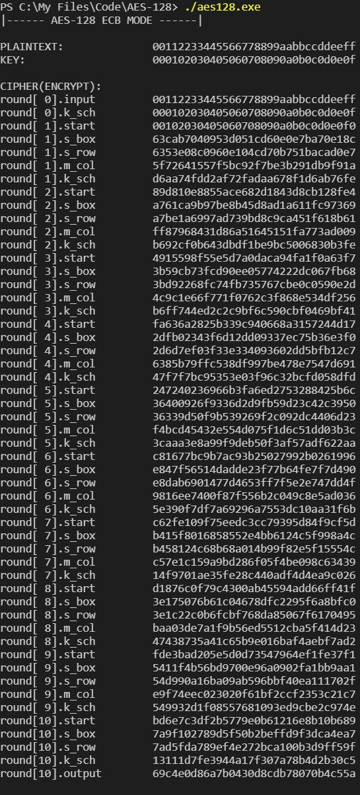
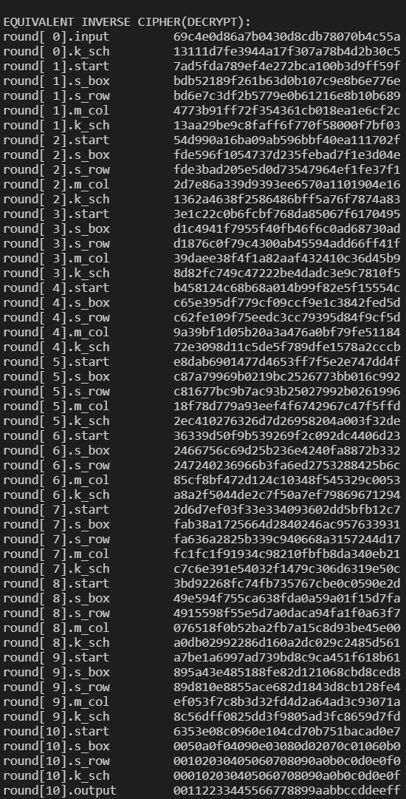
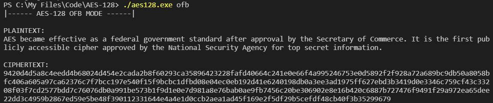

***
## 项目介绍
本项目采用C++11，实现了AES-128密码算法。包括:针对128bit明文块、128bit密钥的基础加密功能，以及OFB（输出反馈）模式工作函数
***
## 编译
```
g++ main.cpp aes128.cpp -o aes128.exe
```
得到可运行文件"aes128.exe"
***
## 运行
具有两个运行模式：
* 基础加密模式（默认）
```
./aes128.exe
```
运行结果  



* 输出反馈模式（加入"ofb"参数）
```
./aes128.exe ofb
```
运行结果  
